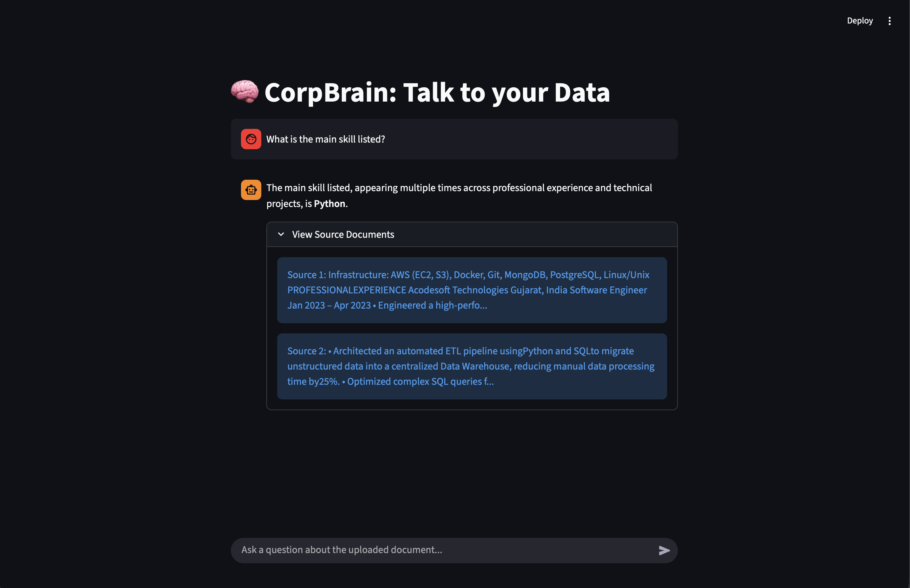

# 👨‍💻 Fenil's AI Portfolio Agent

A RAG-based AI assistant that allows recruiters and hiring managers to "chat" with my resume. instead of reading it. Built with **Google Gemini 2.5**, **Pinecone**, and **LangChain**.

**[🔴 Live Demo: Click Here to Chat with My Resume](https://fenil-corp-brain.streamlit.app)**

## 🤖 What does this do?
Instead of a static PDF, this agent parses my professional experience and answers questions like:
* "What is Fenil's experience with RAG systems?"
* "Has he used FastAPI in production?"
* "What are his salary expectations?"

It uses **Vector Search (Pinecone)** to find the exact section of my resume and **Gemini 2.5** to generate the answer with citations.
